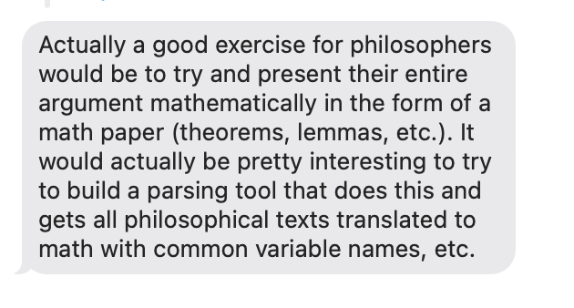

Wittgenstein extracts claims from a PDF/EPUB, formalizes each one (symbolic
logic or plain English), and flags claims likely to have been mis-formalized
— hedges, modal mismatches, ambiguous negation scope, cross-referenced
conditions, nested conditionals — with a plain-language reason for each flag
rather than an opaque score, so a reviewer knows where to focus. This is a
proof-of-concept demo for a grant application, not a production system: the
risk classifier is rule/regex-based (no trained model), and reviewer
decisions are logged to a local JSON file (no real database, no auth).

## Run locally

Start the Flask API (needed either way — it serves `/upload`, `/formalize`, etc.):

```bash
cd server
pip install -r requirements.txt
cp .env.example .env   # fill in OPENAI_API_KEY
python3 app.py          # serves on :3000 (or $PORT)
```

Then, for the client, pick one:

**Editing the UI (hot-reload)** — `vite.config.js` proxies API calls to
`localhost:3000`, so this reflects `.jsx` edits instantly without a rebuild:

```bash
cd client
npm install
npm run dev              # open http://localhost:5173
```

**Just running it as deployed** — Flask serves the built `client/dist`
directly; any time you change client source, you must rebuild or Flask will
keep serving the old bundle:

```bash
cd client
npm install
npm run build             # then open http://localhost:3000
```

Either way: upload a PDF/EPUB, choose a formalization type, and each
resulting claim is shown with its risk tier, flagged reasons, and
Approve/Flag/Reject controls.

See [DEPLOYMENT.md](DEPLOYMENT.md) for deploying to Render.

You will need your own OpenAI API key for now 😔
